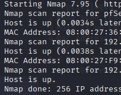

# Nmap Lab Writeup

## Lab Setup
- Kali Linux VM on VirtualBox
- Target VM: Ubuntu server with basic services (SSH, HTTP, FTP)

## Steps
1. Reconnaissance: 'nmap -sn 192.168.1.0/24' to identify all live hosts
2. Port scanning: 'nmap -sS -sV 192.168.1.102' to identify open ports and services
3. Service enumeration: Document results

## Lab Topology
Host (Desktop)
|- Kali (attacker) - 10.0.0.10 (sanitized)
|- Target (victim) - 10.0.0.20 (sanitized)

pfSense active for routing/filtering

Discover -> Enumerate -> Analyze

## nmap scans
1. Ping sweep to discover live hosts (via Kali)
    - Sending "are you alive" probes by ICMP across subnet to identify live IP's.
    - Finds live targets rather than wasting time scanning potentially hundreds of offline targets.
    
2. 

